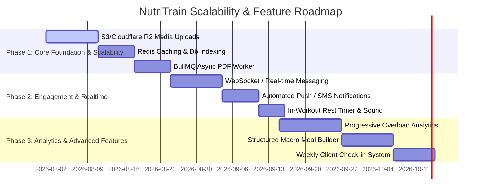

# NutriTrain (Gym-Scale) - Features Audit & Scalability Roadmap

> **File Summary**: Comprehensive catalog of all currently implemented features in the NutriTrain (Gym-Scale) application, alongside actionable recommendations for industry best practices, architecture scalability, security, and feature expansion.

---

## 📋 Part 1: Audit of Currently Implemented Features

NutriTrain is a specialized web & PWA platform designed for fitness trainers, gym clients, and super administrators. The project is built with **Next.js 16 (App Router)**, **React 19**, **Prisma ORM (PostgreSQL)**, **NextAuth v5**, **Tailwind CSS v4**, and **Framer Motion**, featuring full RTL (Persian) support.

---

### 1. 🔐 Authentication & Access Control (RBAC)
- **Role-Based Access Control (RBAC)**: Support for 3 distinct user roles:
  - `SUPER_ADMIN`: System-wide administration and trainer management.
  - `TRAINER`: Managing assigned clients, workout routines, diet plans, recipes, and subscriptions.
  - `CLIENT`: Accessing assigned routines, diet plans, logging workouts, logging body metrics, and messaging trainers.
- **NextAuth.js v5 Beta**: Credentials authentication with custom JWT callbacks and session handling.
- **Demo Trainer Accounts**:
  - Expiration dates (`expiresAt`), client limits (`maxClients`), and granular feature flags (`canCreateDiets`, `canCreateRoutines`, `canAccessRecipes`).
- **Security Features**:
  - Bcrypt password hashing.
  - Security Questions & Answers for password recovery verification.
  - Route protection via Next.js Middleware (`middleware.ts`).

---

### 2. 🛡️ Super Admin Dashboard (`/admin`)
- **Trainer Management**:
  - Overview of all trainers with approval statuses (`isApproved`), active client counts, and subscription limits.
  - Modal to register/create new trainer accounts or demo trainers.
  - Toggle feature permissions (`canCreateDiets`, `canCreateRoutines`, `canAccessRecipes`) and change maximum allowed clients.
- **Client Reassignment**:
  - Reassign clients between trainers dynamically via dedicated UI controls.

---

### 3. 🏋️‍♂️ Trainer Management & Client CRM (`/clients`, `/clients/[id]`)
- **Client Directory**:
  - List and search clients with filter tags (active subscriptions, assigned trainer, deleted status).
  - Add new clients or soft-delete existing clients (`isDeleted`).
- **Subscription Management (`Subscription`)**:
  - Track client plans (VIP 1-month, 3-month, etc.), start/end dates, pricing, notes, and statuses (`ACTIVE`, `PENDING`, `EXPIRED`, `CANCELLED`).
- **Client Profile & Health Tracking**:
  - Body measurements log: Weight, Chest, Waist, Biceps, Thigh (`ClientProgressLog`).
  - Interactive visual progress charts powered by `Recharts` (`client-progress-chart.tsx`).
  - Progress photo gallery (`progress-photo-gallery.tsx`) with image modal previews.
- **Assignment Engine**:
  - Assign Workout Routines and Diet Plans directly to client accounts.
  - View client routine and diet assignment history (`ClientRoutineHistory`, `ClientDietHistory`).

---

### 4. 📝 Advanced Routine Builder & Management (`/routines`)
- **Template & Assigned Clone System**:
  - Maintain master routine templates (`isTemplate = true`) or clone routines to assign to specific clients.
- **Multi-Day Split Configuration**:
  - Weekly schedule assignment across 7 days (Saturday through Friday).
  - Custom day labels (e.g., "Day 1 - Chest & Shoulders").
- **Exercise Configuration & Advanced Techniques (`ExerciseGroupType`)**:
  - Target muscle group selection, set counts, rep target strings (e.g., "10-12", "To failure"), rest duration, weight targets, and custom notes.
  - Advanced technique linkers: **Normal, Superset, Triset, Circuit, Dropset, Rest-Pause, Tempo** with shared `groupId` visual group links.
  - Animated GIF preview URLs and video tutorial URLs (`gif-upload-input.tsx`).
- **PDF Generation & Export (`/routines/[id]/pdf`, `pdf-generator.ts`)**:
  - Puppeteer-backed server-side HTML-to-PDF rendering.
  - Optimized layout for mobile viewing and printable PDF routine schedules.

---

### 5. 📚 Exercise Dictionary (`/exercises`)
- Centralized library of standard gym exercises (`ExerciseDictionary`).
- Searchable muscle groups, exercise descriptions, instructional video URLs, and GIF animation previews.
- Pre-populates exercise data during routine building.

---

### 6. 🥗 Diet Plan Builder, Recipe Library & TDEE Calculator (`/diets`, `/recipes`)
- **Diet Plans (`DietPlan`)**:
  - Rich HTML content diet plan editor.
  - Reusable template library and client-specific assigned diet history.
- **Recipe Library (`Recipe`)**:
  - Detailed recipe entries categorised by meal type (Breakfast, Snack, Lunch/Dinner, High Protein).
  - Macro tracking: Calories, Protein (g), Carbs (g), Fats (g).
  - Prep time, ingredient breakdown, and preparation steps.
- **TDEE & Macro Calculator (`tdee-calculator-modal.tsx`)**:
  - Calculates BMR (Mifflin-St Jeor / Harris-Benedict) and TDEE based on age, gender, height, weight, activity level, and fitness goals (Cut, Maintain, Bulk).
  - Generates recommended daily calorie and macro target distributions.

---

### 7. 📱 Client Portal & Workout Tracker (`/client`)
- **Mobile-First Client Dashboard**:
  - View active assigned workout routines, diet plans, and recipe recommendations.
- **Live Workout Session Tracker (`/client/workout`)**:
  - Interactive daily workout logger (`WorkoutSessionLog`).
  - Track elapsed workout duration in minutes and mark exercises complete.
- **Client Measurement & Photo Logger (`/client/progress`)**:
  - Self-service weight and measurement logging with progress photo attachments.
- **Direct Messaging System (`/client/messages`, `/messages`)**:
  - 1-on-1 messaging between client and assigned trainer with read receipt indicators (`isRead`).

---

### 8. 📲 PWA & Design System
- **Progressive Web App (PWA)**:
  - Mobile installable app experience configured via `@ducanh2912/next-pwa` and service worker (`sw.js`).
- **UI & Accessibility**:
  - Tailored Iranian/Persian RTL typography and dark/light theme toggle (`next-themes`).
  - Toast notification system (`sonner`).

---

---

## 🚀 Part 2: Best Practices & Scalability Roadmap

To elevate NutriTrain to an enterprise-ready, highly scalable SaaS application, the following architectural and feature enhancements are recommended.

---

### 🟢 1. Architecture & Performance Engineering

| Area | Current State | Recommended Upgrade | Impact |
| :--- | :--- | :--- | :--- |
| **PDF Generation** | Direct Puppeteer execution on Next.js server threads | Offload PDF rendering to an asynchronous task queue (BullMQ + Redis) or dedicated edge service (e.g. Browserless.io) | Prevents Next.js process CPU/Memory lockup during concurrent PDF exports |
| **File / Media Storage** | Local files / direct URL strings | AWS S3, Cloudflare R2, or Uploadthing integration with CDN image optimization | Scalable storage for high-res progress photos and exercise GIF animations |
| **Real-Time Communication** | HTTP Request polling | WebSockets / Socket.io / Supabase Realtime / Ably for messaging and live notifications | Instant message delivery, online indicators, lower database query overhead |
| **Caching Layer** | Direct PostgreSQL database queries | Redis caching layer for Exercise Dictionary, Recipes, and static templates | Sub-10ms response times for common dictionary queries |
| **Database Indexing** | Partial indices on foreign keys | Composite indexing on `(trainerId, isTemplate)` and `(clientId, loggedAt)` + Prisma Connection Pooling (PgBouncer/Prisma Accelerate) | Optimized query execution under high concurrent user load |

---

### 🟡 2. Highly Recommended Feature Additions

#### A. 📊 Progressive Overload & Analytics Dashboard
- **Estimated 1RM & Volume Calculations**: Auto-calculate Total Volume (`Sets × Reps × Weight`) and 1 Rep Max estimates per exercise over time.
- **Interactive Progress Charts for Clients**: Visual graphs showing strength progression on key lifts (Bench Press, Squat, Deadlift) over weeks/months.

#### B. 🔔 Automated Notification & Reminder Engine
- **Multi-Channel Alerts**: Web Push Notifications, WhatsApp / SMS (e.g. Kavenegar / SMS IR for Iran region), and Email notifications.
- **Triggered Workflows**:
  - Subscription expiration warning (3 days before end date).
  - Daily workout reminders for scheduled workout days.
  - Inactivity alerts if a client misses logging for >4 days.
  - New message notifications from trainers.

#### C. 🥗 Structured Diet Builder (Macro-Calculated Meals)
- **Granular Meal Structure**: Upgrade Diet Plans from raw HTML text to structured daily meals (Breakfast, Snack 1, Lunch, Snack 2, Dinner).
- **Auto-Calculated Daily Macros**: Link meal items to the Recipe database to automatically calculate total daily Calories, Protein, Carbs, and Fats with target variance warnings.

#### D. ⏱️ In-Workout Rest Timer & Audio Cues
- **Mobile Rest Timer**: Interactive rest timer overlay during live client workout sessions with vibration & audio beep alerts when rest periods end.

#### E. 📋 Weekly Client Check-In Form (Trainer Feedback Loop)
- **Structured Weekly Review**: Automated weekly check-in form for clients measuring:
  - Training Adherence % (0-100%)
  - Nutrition Adherence %
  - Energy levels (1-10), Sleep quality, Stress level, Muscle soreness.
  - Optional upload of current week front/side/back physique photos.

#### F. 💳 Payment Gateway & Automated Subscriptions
- **Payment Integration**: Integration with payment gateways (e.g., ZarinPal, IDPay, or Stripe) for automated subscription renewal, online client payments, and digital receipts.

---

### 🔵 3. Security, Auditing & Compliance

1. **Rate Limiting**:
   - Implement `@upstash/ratelimit` or Next.js API rate limiting on authentication routes (`/api/auth`), messaging endpoints, and PDF generation routes to prevent brute-force attacks and abuse.
2. **Audit Logging (`AuditLog`)**:
   - Add audit logging model to record critical admin/trainer actions (e.g., trainer approval, permissions modified, client deletion, data export).
3. **Data Privacy & Client Data Export**:
   - GDPR / User privacy compliance: export client health and progress data to JSON/CSV or permanently erase client profiles upon request.

---

### 📊 Recommended Implementation Roadmap Matrix

---

*Generated for NutriTrain (Gym-Scale) project analysis.*
