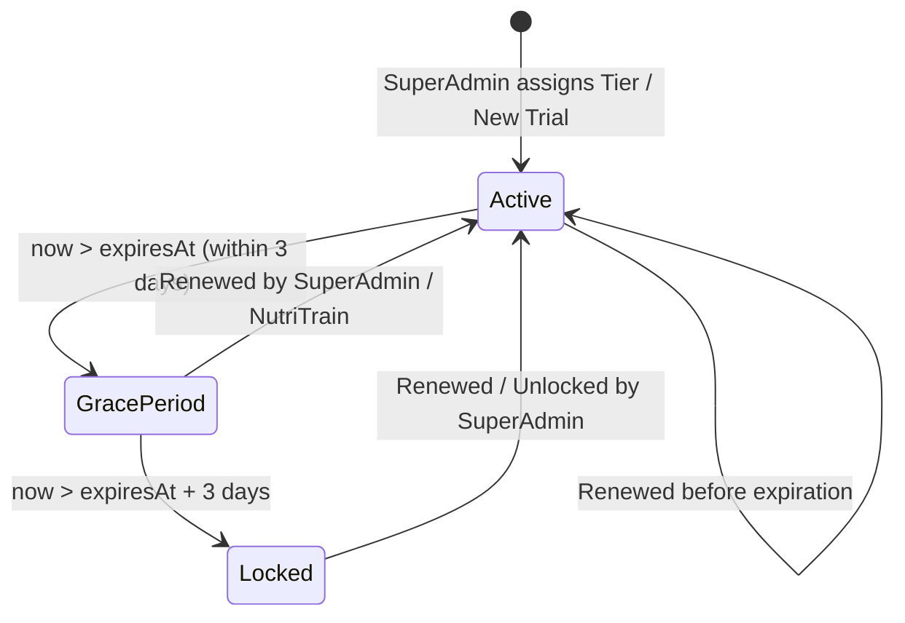

# Data Model: Tiered Gym/Trainer Subscriptions

**Feature**: `001-tiered-subscriptions-header-nav`  
**Date**: 2026-10-06  
**Status**: Ready  

---

## 1. Entities & Schema Changes

### Enum `TrainerTier`
```prisma
enum TrainerTier {
  FREE     // Legacy fallback (maps to TRIAL)
  TRIAL    // آزمایشی: 5 clients, 3 AI, 14 days
  STARTER  // مربی پایه: 25 clients, 30 AI, 30 days
  PRO      // باشگاه حرفه‌ای: 100 clients, 100 AI, 30+ days
}
```

### Entity `Trainer` (PostgreSQL `Trainer` Table)
Represents gym owners, personal coaches, and administrators.

| Field | Type | Default | Nullable | Description |
|---|---|---|---|---|
| `id` | `String` (CUID) | `cuid()` | No | Primary key identifier |
| `name` | `String` | - | No | Coach or Gym full name |
| `email` | `String` | - | No | Unique account login email |
| `role` | `Role` | `TRAINER` | No | `SUPER_ADMIN`, `TRAINER`, or `CLIENT` |
| `tier` | `TrainerTier` | `TRIAL` | No | Subscription tier preset |
| `maxClients` | `Int` | `5` | Yes | Maximum active athlete slots allowed |
| `aiQuota` | `Int` | `3` | No | Available AI routine & diet generations |
| `aiQuotaResetAt` | `DateTime` | `null` | Yes | Timestamp of next monthly quota reset |
| `expiresAt` | `DateTime` | `now() + 14d` | Yes | Plan expiration timestamp (`null` = permanent/admin) |
| `canCreateDiets` | `Boolean` | `true` | No | Ability to create meal plans |
| `canCreateRoutines` | `Boolean` | `true` | No | Ability to create workout routines |
| `canAccessRecipes` | `Boolean` | `true` | No | Ability to access recipe bank |
| `isApproved` | `Boolean` | `true` | No | Admin approval status |

---

## 2. Subscription State Transitions & Lifecycle

### States


1. **`ACTIVE`**:
   - `now <= expiresAt` or `expiresAt === null`
   - All subscribed features operational within numerical limits (`clientCount < maxClients`, `aiQuota > 0`).
2. **`GRACE_PERIOD`**:
   - `now > expiresAt` AND `now <= expiresAt + 3 days` (72 hours).
   - Read-only protection for past clients and workouts.
   - Persistent banner displayed: "اعتبار اشتراک شما به پایان رسیده است؛ ۳ روز مهلت تمدید دارید."
   - Creation of new clients and AI routines blocked.
3. **`LOCKED`**:
   - `now > expiresAt + 3 days`.
   - Access to panel locked; redirected to `/subscription-expired` screen linking to `nutritrain.ir`.

---

## 3. Validation Rules

- **Client Capacity Check**:
  $$\text{Active Clients Count} < \text{maxClients}$$
  Attempting to add a client when count $\ge \text{maxClients}$ must reject with code `TIER_CLIENT_LIMIT_REACHED`.
- **AI Quota Check**:
  $$\text{aiQuota} > 0$$
  Attempting generation when $\text{aiQuota} \le 0$ must reject with code `TIER_AI_QUOTA_EXHAUSTED`.
- **Expiration Grace Period**:
  $$\Delta t = \text{now} - \text{expiresAt}$$
  $$\text{If } \Delta t > 0 \text{ and } \Delta t \le 3 \text{ days} \implies \text{GRACE\_PERIOD}$$
  $$\text{If } \Delta t > 3 \text{ days} \implies \text{LOCKED}$$
